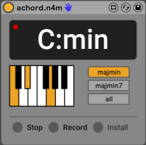

## M4L-Achord

Achord is a Max for Live application which is able to detect tonal information live, directly from an incoming audio signal. Surprisingly, although the supporting research is nearly 20 years old, this sort of application is not currently offered by anyone else within the Max for Live community.

The application uses Node for Max to perform spectral processing on the incoming signal. To be specific, we are performing a Short-Time Fourier Transform (STFT) on overlapping windows of the signal. The resulting spectogram is further processed to extract a Harmonic Pitch Class Profile (Gomez et al., 2006), which is defined as a vector of relative intensities of each of the 12 pitch classes of the equal-tempered scale within an analysis frame. This vector can then be compared to pre-defined templates to determine the corresponding chord label.

Usage
---
The application is currently in development mode, so the only way to use it is to clone this directory. To load the patch as an Ableton Live plug-in, simply drag-and-drop achord.n4m.amxd into the Ableton device area. Make sure to click `install` the first time you are using the patch to install the dependencies. 

Using the plugin is rather rather straightforward: click `record` (the red light will indicate that the application is now live), play some audio and the chord and corresponding note will be displayed on the screen! If the red light turns off for some reason, just click `record` again, this will restart the application. Lastly, if you want to save CPU you can `stop` or deactivate the plugin.

Finally, there are three modes the user can choose from: 
- `majmin` detects only major and minor chords
- `majmin7` which in addition to major and minor, detects major7 and minor7 chords
- `all` detects major, minor, major7, minor7, dominant, augment, and major minor chords

Dev
---
To run tests: `npm install && npm test`

Mocha is used for testing
