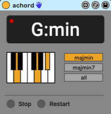

## M4L-Achord

Achord is a Max for Live application which is able to detect tonal information live, directly from an incoming audio signal. Surprisingly, although the supporting research is nearly 20 years old, this sort of application is not currently offered by anyone else within the Max for Live community.

The application uses Node for Max to perform spectral processing on the incoming signal. To be specific, we are performing a Short-Time Fourier Transform (STFT) on overlapping windows of the signal. The resulting spectogram is further processed to extract a Harmonic Pitch Class Profile (Gomez et al., 2006), which is defined as a vector of relative intensities of each of the 12 pitch classes of the equal-tempered scale within an analysis frame. This vector can then be compared to pre-defined templates to determine the corresponding chord label.

Usage
---
To load the patch as an Ableton Live plug-in, simply drag-and-drop builds/achord.amxd into the Ableton device area.

The device should be active when you load it - this is indicated by the red light. In theory that's it but if if you want to save CPU you can `stop` or deactivate the plugin. If you've stopped the plugin, you can use `restart` to activate it again.

There are three chord modes you can choose from: 
- `majmin` detects only major and minor chords
- `majmin7` which in addition to major and minor, detects major7 and minor7 chords
- `all` detects major, minor, major7, minor7, dominant, augment, and major minor chords

Dev
---
To run tests: `npm install && npm test`

Mocha is used for testing
